<div align="center">
  
</div>

<br/>

<div align="center">
  
</div>

<br/>

<div align="center">

[](https://gaziarifin.com)
[](https://mes-case-study.vercel.app)
[](mailto:arifin.yeasin@gmail.com)
[](https://linkedin.com/in/gaziyeasinarifin)

</div>

---

## About

SF Bay Area. I have degrees in both **Software Engineering** and **Interaction Design** — which means I don't just spec products, I build them end to end.

My stack runs from Figma to SwiftUI to the App Store. My build pipeline is fully AI-augmented: I run Claude Code on a headless Mac Mini server as an autonomous agent, queuing overnight tasks while I sleep.

> Previously: Inside Maps · Kite Games Studio (4.8M+ downloads, 3x Top 10)
>
> Now: Indie iOS development · Targeting Senior AI Product Designer roles in the Bay Area

---

## Shipped

<table>
<tr>
<td width="50%" valign="top">

### 💬 Mes — AI Tools for iMessage

All-in-one AI toolkit for iMessage conversations. AI Reply, Polls, Bill Split, Spin Wheel, Countdown, Stickers — powered by **Gemini 2.5 Flash**, natively inside Messages.

[](https://apps.apple.com/app/id6761229621)
[](https://mes-case-study.vercel.app)

`SwiftUI` `iMessage Extension` `Gemini 2.5 Flash` `RevenueCat` `App Groups`

</td>
<td width="50%" valign="top">

### 🛋️ DIY Decor AI — Room Makeover

Snap a photo. Watch your room transform. AI-powered home redesign with style matching and step-by-step DIY instructions. Shipped with 7-language ASO localization.

[](https://apps.apple.com/app/id6760288379)

`SwiftUI` `Gemini 2.0 Flash` `RevenueCat` `iOS 17+`

</td>
</tr>
</table>

---

## Building Now

| Project | What It Is | Status |
|---------|-----------|--------|
| **BreathSpace** | Widget-first breathing and mindfulness app — no onboarding, just breathe | Pre-launch |
| **Daylore** | Calendar + memory diary + wins streak with Metal dissolve animations, Gen Z dark aesthetic | In development |
| **Floored** | CarPlay driving companion with animated mascot | Scaffolded |
| **gaziarifin.com v2** | Next.js 14 + Framer Motion portfolio with horizontal wedge hero animation | Final stretch |

---

## How I Build

My workflow is AI-native, not AI-assisted.

```
Claude Code (agentic) → SwiftUI → Gemini API → RevenueCat → TestFlight → App Store
```

- **Agentic pipeline** — Headless Mac Mini running Claude Code autonomously. Tasks queue, agents execute overnight, I review in the morning.
- **Full-stack by default** — Figma components to SwiftUI views with minimal spec-to-ship drift.
- **Monetization-first** — RevenueCat wired from day one. Subscriptions, paywalls, and trials before the first feature ships.
- **ASO as product** — Metadata, screenshots, and localization are part of the build, not an afterthought.

---

## Stack

<div align="center">

**Design & Motion**


**iOS**


**Web**


**AI & Infra**


</div>

---

## Education

| Degree | Institution |
|--------|-------------|
| M.A. Interaction Design and Interactive Art | California State University, East Bay |
| B.S. Software Engineering | — |

---

## Stats

<div align="center">
  
  &nbsp;
  
</div>

<br/>

<div align="center">
  
</div>

<br/>

<div align="center">
  
</div>

<br/>

<div align="center">
  
</div>
